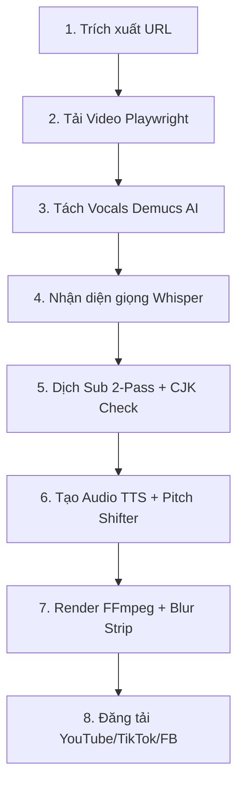

# 🎬 ĐẶC TẢ CHI TIẾT TOÀN BỘ CHỨC NĂNG HỆ THỐNG MBVIETSUB & MIUBONSUB-IOS
> **Bản cập nhật đầy đủ và chi tiết nhất** - Dùng làm tài liệu thiết kế hệ thống, tài liệu API và đặc tả luồng nghiệp vụ (BluePrint) để phát triển hoặc viết mới ứng dụng Client iOS.

---

## 📂 1. CHI TIẾT CẤU TRÚC DỮ LIỆU & THƯ MỤC BACKEND (E:\MiuBonVSub\MBVietSub)

Hệ thống lưu trữ cấu hình, trạng thái hàng đợi, thông tin cookies và hàng đợi tải lên thông qua các tệp JSON và thư mục chuyên biệt:

### A. Các Tệp Trạng Thái và Cấu Hình Hệ Thống
1.  **`config.json`:** Lưu trữ toàn bộ cấu hình hoạt động của Server. Tệp này được đồng bộ hai chiều với tab *Cài đặt* trên ứng dụng iOS. Các khóa cấu hình quan trọng gồm:
    *   `projects_dir`: Thư mục lưu trữ các project (mặc định: `D:/anti-sub-projects`).
    *   `gpu_heavy_concurrency` / `max_concurrent_gpu`: Giới hạn số lượng tác vụ nặng chạy song song trên GPU (Demucs, Whisper).
    *   `download_concurrency`: Số lượng video được tải xuống đồng thời (mặc định: `2`).
    *   `ffmpeg_encoder`: Bộ mã hóa video (`h264_nvenc` cho GPU NVIDIA, `libx264` cho CPU).
    *   `translation_provider` & `translation_provider_order`: Trình dịch chính và danh sách dự phòng (`9router,ollama,azure,deepl,gemini`).
    *   `tts_engine`: Động cơ thuyết minh (`gemini`, `vieneu`, `capcut`, `capcut_native`).
    *   `youtube_upload_strategy`: Chiến lược upload (`round_robin` hoặc `sequential_fallback`).
2.  **`jobs_state.json`:** Lưu trữ trạng thái của tất cả các tiến trình đơn và tiến trình hàng đợi (Batch).
    *   Hệ thống khởi chạy một luồng ngầm (`_auto_save_worker`) để tự động ghi trạng thái từ bộ nhớ RAM xuống tệp này mỗi **5 giây** một lần.
    *   Khi khởi động server (`_load_state`), nếu phát hiện bất kỳ job nào có trạng thái `running` hoặc `queued` (bị ngắt do tắt máy đột ngột), server sẽ tự động đổi trạng thái sang `error` kèm thông báo *"Server đã khởi động lại trước khi hoàn thành"*.
3.  **`series_library_registry.json`:** Đăng ký danh sách các phim bộ (Series) cùng thư mục lưu trữ và tập phim tương ứng. Nằm trong thư mục `projects_dir`.
4.  **`douyin_cookies.json`:** Lưu trữ cookies đăng nhập Douyin dạng JSON thu được sau khi người dùng quét mã/đăng nhập Chromium qua Tab Auth.
5.  **`douyin_cookies.txt`:** Cookies Douyin được xuất tự động sang định dạng Netscape tiêu chuẩn để thư viện `yt-dlp` có thể đọc và vượt qua cơ chế chặn tải của CDN Douyin.
6.  **`youtube_upload_queue.json`:** Danh sách các video đang chờ tải lên YouTube.
7.  **`youtube_upload_queue_failed.json`:** Lưu vết lịch sử tối đa 200 tác vụ upload YouTube bị lỗi sau khi đã thử lại vượt quá số lần cấu hình (`youtube_upload_queue_max_attempts`, mặc định là `20`).

### B. Cấu Trúc Thư Mục Một Project
Mỗi liên kết video nạp vào Pipeline sẽ được tạo một thư mục riêng dưới dạng `project_YYYYMMDD_HHMMSS_UUID`. Bên trong chứa:
*   `info.json`: Trạng thái dự án, số tập phim, series cha, các bước đã hoàn thành (`steps_completed` gồm: `download`, `separate`, `stt`, `translate`, `tts`, `render`, `metadata`, `upload`).
*   `process.log`: Nhật ký chi tiết tiến trình của riêng project đó (phục vụ việc gọi log từ App iOS).
*   `input_video.mp4`: Video gốc tải về.
*   `vocals.wav` / `no_vocals.wav`: File giọng nói và file nhạc nền sau khi tách bằng Demucs.
*   `source.srt`: Phụ đề tiếng Trung nhận diện từ Whisper.
*   `translated.srt`: Phụ đề tiếng Việt sau khi dịch.
*   `tts_dubbed.mp3` / `tts_dubbed.wav`: File thuyết minh tiếng Việt được ghép lại.
*   `final_video.mp4`: Video thành phẩm hoàn thiện sau khi render (burn sub Việt, đè tiếng Việt, ghép intro, làm mờ sub Trung).
*   `final_video_tiktok.mp4`: Video 9:16 chuyên biệt cho TikTok (nếu bật auto-split/render vertical).
*   `thumbnail.jpg`: Ảnh thu nhỏ (thumbnail) được tạo tự động hoặc do AI vẽ.
*   `metadata.json`: Tiêu đề, mô tả và thẻ tag tiếng Việt do AI sinh ra.

---

## ⚙️ 2. PHÂN TÍCH CHUYÊN SÂU 8 BƯỚC PIPELINE TỰ ĐỘNG (pipeline.py)

Quy trình tự động hóa hoạt động trên GPU/CPU máy chủ được đặc tả chi tiết về mặt thuật toán và xử lý kỹ thuật như sau:



### Bước 1: Trích xuất URL (url_extractor.py)
*   **Regex trích xuất:** Sử dụng biểu thức chính quy `https?://[^\s"'<>)\]]+` để lọc các liên kết sạch khỏi nội dung văn bản thô/tin nhắn chia sẻ từ Douyin/TikTok.
*   **Xử lý link rút gọn:** Gọi phương thức `_resolve_short_url` thực hiện HTTP HEAD request (với User-Agent giả lập di động iPhone OS 16) để giải quyết các liên kết ngắn `v.douyin.com` thành liên kết đầy đủ dạng `https://www.douyin.com/video/AWEME_ID`.
*   **Hỗ trợ WARP:** Nếu `douyin_warp_enabled` được kích hoạt, luồng giải quyết link sẽ đi qua SOCKS5 proxy `127.0.0.1:40000` để tránh bị chặn IP.

### Bước 2: Tải video (downloader.py)
*   **Playwright Browser Interceptor:**
    1.  Khởi chạy Chromium với cấu hình ngăn phát hiện bot: `executable_path` có thể tùy chọn Edge/Opera/Opera GX, tắt cờ tự động hóa `--disable-blink-features=AutomationControlled`.
    2.  Nạp cookies đã lưu. Inject mã Javascript ẩn danh: giả lập `navigator.webdriver = undefined`, `navigator.languages = ['zh-CN', 'zh']`.
    3.  Lắng nghe sự kiện mạng: chặn và phân tích các response từ API `aweme/detail` hoặc `aweme/v1/web/aweme/detail`. Trích xuất trực tiếp link video gốc chất lượng cao không logo từ trường `play_addr.url_list[0]` hoặc `bit_rate[0].play_addr.url_list[0]`.
    4.  Nếu CDN trả về link có logo (`playwm`), thực hiện thay thế chuỗi tự động `playwm` -> `play` để lấy bản sạch.
*   **Nhận diện tập phim qua ảnh bìa (Tesseract OCR Fallback):**
    *   Nếu mô tả video không chứa thông tin tập phim, tải ảnh bìa `douyin_cover`.
    *   Gọi công cụ **Tesseract OCR** local để quét chữ tiếng Trung/Anh trên ảnh: `tesseract cover.jpg stdout -l chi_sim+eng --psm 6`.
    *   Dùng Regex lọc số tập dạng `第[0-9]+集` để điền tự động trường `episode_no`.
*   **Tải file lớn resumable:**
    *   Sử dụng thư viện `requests` thực hiện tải luồng (stream) với tiêu đề `Range: bytes={downloaded}-` cho phép tải tiếp khi mất mạng.
    *   Nếu một phân đoạn bị hỏng giữa chừng, server tự động thực hiện lệnh `truncate` cắt bỏ phần file lỗi về mốc byte tải thành công gần nhất trước khi ghi tiếp.

### Bước 3: Tách giọng nói (separator.py)
*   **Demucs AI Model:** Gọi mô hình tách nguồn âm thanh **Demucs** (`htdemucs` v4).
*   **Cơ chế khóa phần cứng:** Luồng xử lý được bọc trong bộ khóa `gpu_heavy_slot`. Chỉ chạy tối đa số tác vụ đồng thời quy định tại `gpu_heavy_concurrency` để tránh cạn kiệt VRAM GPU.
*   **Kết quả:** Xuất ra tệp `vocals.wav` (chứa giọng nói nhân vật tần số 24000Hz) và `no_vocals.wav` (chứa nhạc nền và tiếng động môi trường).

### Bước 4: Nhận dạng giọng nói (transcriber.py)
*   **faster-whisper:** Nạp mô hình nhận dạng giọng nói tự động. Tự động kiểm tra thông tin phần cứng bằng PyTorch:
    *   Nếu GPU có hỗ trợ CUDA và chỉ số Compute Capability < 7 (đời cũ Pascal): Nạp chế độ `device="cuda", compute_type="int8"`.
    *   Nếu đời Turing/Ampere (RTX 20xx, 30xx, 40xx): Nạp chế độ `device="cuda", compute_type="float16"`.
    *   Nếu không có GPU: Nạp `device="cpu", compute_type="int8"`.
*   **Xuất SRT:** Nhận diện ngôn ngữ gốc (`zh` hoặc `en`), tự động gom các câu nói ngắn thành các dòng phụ đề có mốc thời gian (timestamp) chuẩn xác dạng `00:00:00,000 --> 00:00:00,000`.

### Bước 5: Dịch phụ đề (translator.py)
*   **Cơ chế dịch song hành 2-Pass:**
    *   *Pass 1 (Dịch thô):* Gửi một mảng gồm tối đa 70 dòng SRT thô lên AI (9Router/WebAI/Gemini). Nạp kèm prompt phong cách dịch (`STYLE_PROMPTS`) và từ điển riêng (`glossary`). Yêu cầu AI trả về định dạng đánh số dòng nghiêm ngặt để khớp vị trí: `[1] Dịch dòng 1 \n [2] Dịch dòng 2`.
    *   *Pass 2 (Rà soát - Review):* Gửi lại cả câu gốc và câu dịch thô lên AI để rà soát lỗi chính tả, văn phong lồng tiếng, và tính nhất quán của đại từ nhân xưng.
*   **Slang & Dịch thuật Gen Z:**
    *   Áp dụng bảng ánh xạ từ lóng sau khi dịch để tạo cảm giác tự nhiên khi thuyết minh: `'chết' -> 'chớt'`, `'thất bại' -> 'toang'`, `'khoan đã' -> 'khoan khoan khoan'`, `'đừng mà' -> 'đừng nha má'`.
*   **Bộ lọc CJK Untranslated Check:**
    *   Quét qua phụ đề đã dịch bằng Regex kiểm tra ký tự tượng hình Trung-Nhật-Hàn: `[\u4e00-\u9fff...]`.
    *   Nếu tỷ lệ ký tự CJK vượt quá 30%, đánh dấu dòng đó là chưa dịch và gọi hàm `_retranslate_untranslated_cues` tự động gửi riêng dòng đó dịch lại bằng provider dự phòng.

### Bước 6: Thuyết minh (tts_engine.py)
*   **Xử lý Audio Customization & Pitch Shifter:**
    *   Hỗ trợ cấu hình `tts_speed`, `tts_pitch`, `tts_volume`.
    *   *Pitch Shifter:* Dùng bộ lọc FFmpeg `asetrate={SAMPLE_RATE}*{pitch},aresample={SAMPLE_RATE}` để thay đổi tông giọng (trầm/bổng) mà không làm méo tần số mẫu.
    *   *Speed (atempo):* FFmpeg chỉ hỗ trợ tăng tốc độ trong khoảng `0.5 - 2.0` cho mỗi filter. Nếu tốc độ yêu cầu > 2.0 (ví dụ 2.4), thuật toán tự động xâu chuỗi: `atempo=2.0,atempo=1.2`.
*   **Hai cơ chế đồng bộ dòng thời gian:**
    *   *Cách 1 (Auto-adjust speed = ON):* Căn chỉnh file thuyết minh của từng câu khớp khít với mốc thời gian SRT. Nếu file đọc dài hơn thời gian hiển thị phụ đề, tự động tăng tốc đọc (tối đa 2.5x), sau đó chèn khoảng lặng (silence) vào các đoạn trống rồi ghép nối tuần tự (`concat`).
    *   *Cách 2 (Auto-adjust speed = OFF):* Cho phép các câu thuyết minh đè/gối đầu lên nhau tự nhiên nếu nhân vật nói nhanh. Tính toán mốc bắt đầu tính bằng mili-giây, áp dụng filter `adelay={delay_ms}:all=1` cho từng file âm thanh nhỏ rồi trộn lại bằng `amix`.
    *   *Lách giới hạn CMD của Windows:* Nếu số lượng file âm thanh cần mix vượt quá 80 file, hệ thống sẽ chia nhỏ thành các nhóm 80 file để mix trung gian trước khi gộp vào tệp cuối cùng.

### Bước 7: Biên tập video (renderer.py)
*   **Đọc thông tin Font Family trực tiếp từ tệp tin nhị phân (.ttf/.otf):**
    *   Mở tệp font, giải mã bảng `name` nhị phân, tìm bản ghi `nameID=1` (Font Family Name) dạng UTF-16-BE hoặc ASCII để lấy đúng tên font đăng ký với hệ thống (tránh lỗi lệch tên tệp và tên font trong FFmpeg libass).
*   **Video Compositing nâng cao:**
    *   *Pass 1:* Gương video (`hflip`), xoay video nghiêng nhẹ (`rotate`), chia luồng video làm 2 bản để làm mờ phụ đề gốc (`split=2[base][blur]`), bản thứ hai được cắt (`crop`) lấy dải phụ đề Trung Quốc, làm mờ (`boxblur`), sau đó đè ngược trở lại (`overlay`) lên bản gốc tại vị trí `mask_y_pct`.
    *   *Pass 2:* Ghép nhạc nền đã giảm âm lượng (`volume=0.35`) với giọng đọc tăng âm lượng (`volume=1.5`) qua `amix`. Đè phụ đề Việt bằng filter `subtitles` đã cấu hình style màu sắc dạng ASS `&H00BBGGRR&`.
    *   *Pass 3:* Scale video intro khớp độ phân giải và framerate của video chính rồi ghép nối (`concat`) vào đầu video thành phẩm.

### Bước 8: Đăng tải tự động (uploader.py / facebook_reels.py / tiktok_uploader.py)
*   **YouTube Multi-Channel Rotation:**
    *   Quét thư mục `youtube_tokens` lấy toàn bộ file xác thực `.pkl`.
    *   Lọc bỏ các token đã bị đánh dấu khóa tạm thời trong 24 giờ do hết hạn quota (`youtube_exhausted_tokens`).
    *   Thực hiện chọn tài khoản theo vòng (`youtube_rr_counter % len(enabled_channels)`).
    *   Tải lên dạng Chunk lớn (`resumable=True`, kích thước gói `10MB`).
*   **Facebook Reels & Page Upload Flow:**
    *   *Reels:* Khởi tạo upload qua `POST /video_reels` nhận về `video_id` và `upload_url`. Gửi file nhị phân trực tiếp dạng `application/octet-stream` lên `rupload.facebook.com` kèm header `Authorization: OAuth {token}`. Xác nhận hoàn tất và thăm dò (`_poll_status`) trường `publishing_phase.status` cho đến khi báo thành công.
    *   *Page Video:* POST Multipart form chứa file nhị phân trường `source` lên `graph-video.facebook.com/.../videos`.
*   **TikTok Auto-Split & Playwright Upload:**
    *   Tự động cắt video gốc thành các đoạn nhỏ dưới `tiktok_max_minutes` phút.
    *   Sử dụng Selenium/Playwright tự động điền form, chọn file cắt và bấm đăng ngầm.

---

## 💻 3. KHẢO SÁT & MAPPING ĐẦY ĐỦ API BACKEND LÊN 8 TAB APP IOS

Đặc tả hoạt động chi tiết của từng tab giao diện trên ứng dụng Client Native SwiftUI:

### Tab 1: Xử Lý (PipelineView)
*   **Giao diện:**
    *   Grid thông tin sức khỏe hệ thống: Hiển thị 4 thẻ trạng thái lấy từ API `GET /api/health`.
    *   Khung nhập văn bản `TextEditor`: Đồng bộ với biến `@Published var urlInput`.
    *   Nút bấm:
        *   "Chạy 1 link": Kích hoạt `POST /api/pipeline/start` kèm body `{"url": urls[0]}`.
        *   "Chạy queue": Kích hoạt `POST /api/pipeline/batch` kèm body `{"urls": urlInput}`.
    *   Thanh tiến trình: Cập nhật biến `pipelineProgress` (lấy từ dữ liệu API polling `/api/job/<id>` hoặc `/api/pipeline/queue/<id>`).
    *   Màn hình log: View scroll hiển thị biến `logLines` (lọc 180 dòng cuối).

### Tab 2: Đang Chạy (RunningView)
*   **Giao diện:**
    *   Danh sách `ScrollView` hiển thị các card Queue đang chạy từ API `GET /api/pipeline/queues`.
    *   Mỗi Card hiển thị số lượng video con (`completed/total`), tên Queue và trạng thái.
    *   Hộp điều khiển:
        *   Nút "Tạm dừng": Gọi `POST /api/pipeline/queue/<id>/pause`.
        *   Nút "Tiếp tục": Gọi `POST /api/pipeline/queue/<id>/resume`.
        *   Nút "Bỏ qua": Gọi `POST /api/pipeline/queue/<id>/skip`.
    *   Hộp Console Log: Khi chạm chọn một item trong hàng đợi, ứng dụng sẽ gọi API `GET /api/pipeline/queue/<queue_id>/item/<item_index>/logs?offset=<offset>`. Dữ liệu trả về sẽ được gom tiếp vào mảng `runtimeLogLines` (tối đa 400 dòng) và tăng biến offset để tránh kéo lại dữ liệu cũ.

### Tab 3: Quét (ScraperView)
*   **Giao diện:**
    *   Khung nhập địa chỉ Profile Douyin (`scrapeURL`).
    *   Khung cấu hình phụ: `scrapeMinDuration` (Giây tối thiểu) và Toggle `scrapeOldestFirst` (Cũ trước).
    *   Nút "Quét video": Gọi API `POST /api/douyin/scrape` nhận về `job_id`, kích hoạt vòng lặp gọi `GET /api/douyin/scrape/<job_id>` để cập nhật trạng thái quét.
    *   **Công cụ AI Gom nhóm:**
        *   Nút "Dịch caption": Gọi `POST /api/douyin/translate-captions` để dịch hàng loạt mô tả phim Trung -> Việt.
        *   Nút "Gom nhóm AI": Gọi `POST /api/douyin/group-series` để AI phân tích tên phim và xếp tập.
        *   Danh sách nhóm: Hiển thị các `AISeriesGroup` dạng Card có ô chọn (`CheckBox`).
        *   Nút "Thêm video mới" hoặc "Chạy queue": Lấy danh sách video đã chọn gửi lên `POST /api/pipeline/batch` kèm theo bản đồ ngữ cảnh `contexts` để server nhận diện thư mục lưu trữ và số tập phim thực tế.
    *   **Douyin Watchdog:** Khung cấu hình bật/tắt, danh sách nhiều tài khoản theo dõi, chu kỳ quét. Gọi API `POST /api/douyin/watchdog/config` để lưu và `POST /api/douyin/watchdog/run-once` để chạy quét ngay lập tức.

### Tab 4: Dự Án (ProjectsView)
*   **Giao diện:**
    *   *Thư viện Series:* Nạp dữ liệu từ API `GET /api/series` hiển thị các thư mục phim bộ.
    *   *Dự án đơn lẻ:* Nạp dữ liệu từ API `GET /api/projects`.
    *   Mỗi card project hiển thị tên phim tiếng Việt (lấy từ `metadata.title` hoặc `series_name`), dải tiến độ dạng chuỗi: `download -> render -> upload`.
    *   Nút tác vụ:
        *   "Xem": Gọi hàm phát video trực tuyến.
        *   "Resume": Gọi API `POST /api/project/<folder_name>/resume` để máy chủ chạy tiếp bước lỗi.

### Tab 5: Xem Phim (VideosView)
*   **Giao diện:**
    *   Menu phân loại dạng Picker: "Series" (Phim bộ) hoặc "Lẻ" (Standalone).
    *   Bố cục dạng lưới đẹp mắt (`LazyVGrid`) hiển thị ảnh bìa phim (`thumbnail.jpg`) tải trực tiếp từ server qua endpoint `/api/project/<project_name>/stream/thumbnail.jpg`.
    *   **Trình phát video nâng cao (AVPlayer Sheet):**
        *   Khi click vào tập phim, hiển thị trình phát phim ghi đè toàn màn hình.
        *   **Cơ chế nguồn phát kép:**
            *   Nút "Cloudflare Stream": Gọi stream file `/api/project/<name>/stream/final_video_preview.mp4` (Bản thành phẩm full chất lượng cao).
            *   Nút "Drive Stream": Gọi stream file `/api/project/<name>/stream/preview` (Bản xem trước dung lượng nhẹ).
        *   **Tự động lưu tiến trình xem:** Khi đóng player hoặc phát hết tập, ứng dụng tính toán thời gian xem hiện tại (`player.currentTime().seconds`), gọi API `POST /api/user/progress` gửi kèm mã token tài khoản đăng nhập để ghi nhớ vị trí phát.
        *   **Phát liên tục:** Khi nhận được thông báo `.AVPlayerItemDidPlayToEndTime`, trình phát tự động gọi hàm `playNextVideo()`, chuyển tập tiếp theo trong danh sách và tự động tua (seek) đến mốc thời gian đã xem trước đó từ biến `watchProgress`.

### Tab 6: Công Cụ (UploadsView)
*   **Giao diện:**
    *   Bảng trạng thái liên kết các bên: YouTube, TikTok, Facebook, Drive.
    *   Nút đăng nhập mạng xã hội: Gọi API mở trang OAuth.
    *   Khung đăng nhanh (Quick Upload): Chọn tên dự án từ menu cuộn, bấm chọn nút TikTok, Facebook hoặc Drive để kích hoạt API upload thủ công cho riêng dự án đó mà không qua pipeline.
    *   Hàng đợi YouTube: Đọc dữ liệu từ API `GET /api/youtube/queue` hiển thị danh sách hàng đợi tải lên YouTube thô trên máy chủ.
    *   Nút "Sắp xếp tập": Gọi API `POST /api/youtube/queue/sort` sắp xếp hàng đợi theo thứ tự số tập phim từ nhỏ đến lớn.

### Tab 7: Từ Điển (DictionaryView)
*   **Giao diện:**
    *   Trình chọn Series dạng Dropdown để tải từ điển tương ứng qua API `GET /api/series/<series_folder>/glossary`.
    *   Nút "AI trích xuất": Gọi API `POST /api/series/<series_folder>/glossary/extract` để AI quét tìm tên riêng trong file SRT Trung Quốc và đề xuất nghĩa Hán Việt.
    *   Danh sách từ khóa: Các dòng chứa từ gốc và từ dịch cho phép chỉnh sửa trực tiếp. Bấm nút "Lưu" để gọi `POST /api/series/<series_folder>/glossary` gửi bộ từ điển lên server.

### Tab 8: Cài Đặt (SettingsView)
*   **Giao diện:**
    *   Khung đăng nhập tài khoản người xem phim (đồng bộ dữ liệu xem phim giữa các máy).
    *   Khung cấu hình địa chỉ IP máy chủ (`backendURL` - Lưu tại `UserDefaults` khóa `miubon.backendURL`).
    *   Thay đổi giao diện ứng dụng: Light/Dark/System.
    *   Hộp điều khiển VPN: Gọi các API kiểm tra IP server, bật/tắt VPN để lách giới hạn của Douyin.
    *   **Trình chỉnh sửa cấu hình hệ thống:** Hiển thị 7 nhóm cài đặt phân loại dạng `DisclosureGroup`. Khi người dùng sửa đổi và bấm "Lưu cài đặt", ứng dụng sẽ định dạng lại các kiểu dữ liệu (chuyển chuỗi "true"/"false" về boolean, chuyển chuỗi số về kiểu số thực/nguyên) và gửi POST yêu cầu cập nhật file `config.json` của server.

---

## 🛠️ 4. KHUNG THIẾT KẾ & PHÁT TRIỂN APP IOS MỚI (BluePrint)

Đề xuất giải pháp kiến trúc và mã nguồn mẫu cho việc phát triển ứng dụng iOS mới:

### 1. Kiến trúc quản lý trạng thái (AppState & API Wrapper)
Nên xây dựng một lớp Singleton `NetworkManager` quản lý việc gọi API kết hợp với cơ chế xác thực JWT Token:

```swift
import Foundation
import Combine

class NetworkManager: ObservableObject {
    static let shared = NetworkManager()
    
    @Published var backendURL: String = UserDefaults.standard.string(forKey: "miubon.backendURL") ?? "http://192.168.1.10:2209"
    @Published var authToken: String = UserDefaults.standard.string(forKey: "miubon.authToken") ?? ""
    @Published var isOnline: Bool = false
    
    private var cancellables = Set<AnyCancellable>()
    
    func request<T: Decodable>(_ path: String, method: String = "GET", body: [String: Any]? = nil) -> AnyPublisher<T, Error> {
        let cleanBase = backendURL.trimmingCharacters(in: .whitespacesAndNewlines).trimmingCharacters(in: CharacterSet(charactersIn: "/"))
        guard let url = URL(string: cleanBase + path) else {
            return Fail(error: URLError(.badURL)).eraseToAnyPublisher()
        }
        
        var request = URLRequest(url: url)
        request.httpMethod = method
        request.setValue("application/json", forHTTPHeaderField: "Content-Type")
        if !authToken.isEmpty {
            request.setValue("Bearer \(authToken)", forHTTPHeaderField: "Authorization")
        }
        
        if let body = body {
            request.httpBody = try? JSONSerialization.data(withJSONObject: body)
        }
        
        return URLSession.shared.dataTaskPublisher(for: request)
            .map(\.data)
            .decode(type: T.self, decoder: JSONDecoder())
            .receive(on: DispatchQueue.main)
            .eraseToAnyPublisher()
    }
}
```

### 2. Tối ưu hóa Stream Video & Trình phát AVPlayer
Để trình phát AVPlayer hoạt động mượt mà với cả hai nguồn phát (Cloudflare/Drive), cần viết một SwiftUI Wrapper hỗ trợ quản lý trạng thái phát tốt hơn:

```swift
import SwiftUI
import AVKit

struct AdvancedVideoPlayer: UIViewControllerRepresentable {
    let videoURL: URL
    let startPosition: Double
    var onTimeUpdate: (Double) -> Void
    var onVideoEnded: () -> Void

    func makeUIViewController(context: Context) -> AVPlayerViewController {
        let controller = AVPlayerViewController()
        let player = AVPlayer(url: videoURL)
        controller.player = player
        controller.showsPlaybackControls = true
        
        // Cấu hình âm thanh phát ra loa ngoài ngay cả khi bật chế độ im lặng
        try? AVAudioSession.sharedInstance().setCategory(.playback, mode: .moviePlayback, options: [])
        
        // Lắng nghe sự kiện kết thúc
        context.coordinator.subscribeToVideoEnd(player: player, action: onVideoEnded)
        
        // Tua đến mốc đã xem trước đó
        if startPosition > 2.0 {
            player.seek(to: CMTime(seconds: startPosition, preferredTimescale: 600))
        }
        
        player.play()
        
        // Theo dõi thời gian phát
        context.coordinator.addTimeObserver(player: player, callback: onTimeUpdate)
        
        return controller
    }

    func updateUIViewController(_ uiViewController: AVPlayerViewController, context: Context) {
        // Cập nhật URL nếu chuyển tập
    }

    func makeCoordinator() -> Coordinator {
        Coordinator(self)
    }

    class Coordinator: NSObject {
        var parent: AdvancedVideoPlayer
        private var timeObserverToken: Any?
        private var endObserver: NSObjectProtocol?

        init(_ parent: AdvancedVideoPlayer) {
            self.parent = parent
        }

        func addTimeObserver(player: AVPlayer, callback: @escaping (Double) -> Void) {
            let interval = CMTime(seconds: 2.0, preferredTimescale: CMTimeScale(NSEC_PER_SEC))
            timeObserverToken = player.addPeriodicTimeObserver(forInterval: interval, queue: .main) { time in
                callback(time.seconds)
            }
        }

        func subscribeToVideoEnd(player: AVPlayer, action: @escaping () -> Void) {
            if let currentItem = player.currentItem {
                endObserver = NotificationCenter.default.addObserver(
                    forName: .AVPlayerItemDidPlayToEndTime,
                    object: currentItem,
                    queue: .main
                ) { _ in
                    action()
                }
            }
        }

        deinit {
            if let token = timeObserverToken {
                // Hủy theo dõi thời gian khi đóng trình phát
                timeObserverToken = nil
            }
        }
    }
}
```

### 3. Giải pháp hiển thị Log thời gian thực (SSE/WebSockets thay cho Polling)
*   **Vấn Đề:** Trong app hiện tại, tab *Đang chạy (RunningView)* liên tục gửi request HTTP GET lên `/api/pipeline/queue/.../logs` cứ mỗi vài giây một lần. Cách làm này gây hao pin điện thoại và tăng tải không cần thiết cho server.
*   **Giải Pháp Thiết Kế Mới:** Backend nên viết thêm một endpoint Server-Sent Events (SSE) `/api/pipeline/queue/<id>/item/<index>/logs/stream` hoặc sử dụng Socket.IO.
*   *Mã nguồn SwiftUI Client lắng nghe SSE:*

```swift
import SwiftUI

class RealtimeLogViewModel: ObservableObject {
    @Published var logs: [String] = []
    private var urlSession: URLSession?
    private var eventSourceTask: URLSessionDataTask?

    func startStreamingLogs(backendURL: String, queueId: String, itemIndex: Int) {
        self.logs = []
        let path = "\(backendURL)/api/pipeline/queue/\(queueId)/item/\(itemIndex)/logs/stream"
        guard let url = URL(string: path) else { return }

        var request = URLRequest(url: url)
        request.setValue("text/event-stream", forHTTPHeaderField: "Accept")
        request.timeoutInterval = 3600 // Giữ kết nối lâu dài

        urlSession = URLSession(configuration: .default)
        eventSourceTask = urlSession?.dataTask(with: request)
        // Lắng nghe luồng dữ liệu truyền về từ server và thêm trực tiếp vào mảng logs
        eventSourceTask?.resume()
    }
    
    func stopStreaming() {
        eventSourceTask?.cancel()
        urlSession?.invalidateAndCancel()
    }
}
```

### 4. Thiết kế chạy nền & Cơ chế thông báo APNs (Push Notifications)
*   *Vấn đề chạy ngầm trên iOS:* Khi ứng dụng bị người dùng chuyển xuống chế độ chạy nền, hệ điều hành iOS sẽ tạm ngưng tiến trình mạng (`URLSession`) sau tối đa **30 giây** để tiết kiệm điện.
*   *Thiết kế mới:* 
    1.  Ứng dụng iOS khi khởi động sẽ yêu cầu quyền nhận thông báo và gửi mã `device_token` lên backend lưu trữ.
    2.  Khi một hàng đợi (Queue) hoàn tất hoặc gặp lỗi, backend sẽ gửi một lệnh push notification trực tiếp qua cổng **APNs (Apple Push Notification service)** đến thiết bị người dùng.
    3.  Nhờ vậy, người dùng không cần mở app liên tục mà vẫn nhận được thông báo thời gian thực ngay khi render xong hoặc uploader hoàn thành.
